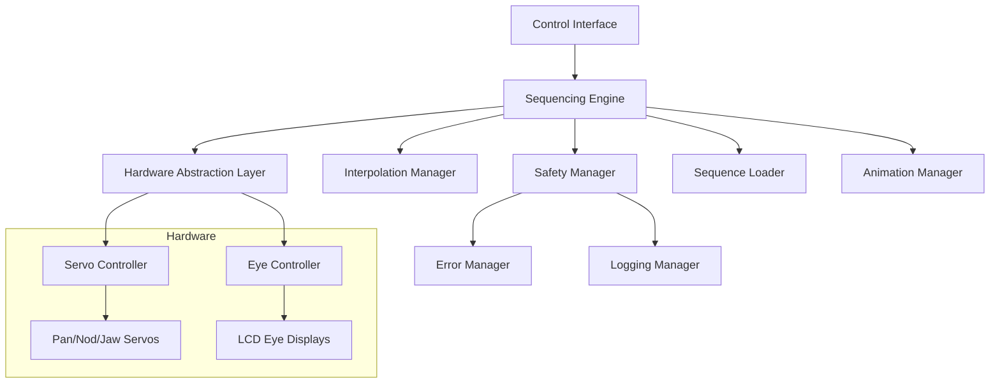

# Design Document

## Overview

The Animatronic Sequencer system extends the existing proof-of-concept into a comprehensive animation control framework. The design maintains the current hardware interface (Pololu Maestro servo controller, LVGL-based eye displays) while adding sophisticated sequencing, interpolation, and control capabilities.

The architecture follows a layered approach: a hardware abstraction layer manages servo and display control, a sequencing engine handles animation playback and interpolation, and a control interface provides real-time interaction capabilities. This separation enables both scripted sequences and dynamic procedural animations while maintaining safety and reliability.

## Architecture

### System Components



### Core Architecture Principles

1. **Separation of Concerns**: Hardware control, animation logic, and user interface are cleanly separated
2. **Safety First**: All operations go through safety validation before hardware execution
3. **Extensibility**: Plugin architecture allows new animation modes and control methods
4. **Real-time Capable**: System supports both pre-planned sequences and real-time control
5. **Hardware Abstraction**: Core logic is independent of specific servo controllers or displays

## Components and Interfaces

### Hardware Abstraction Layer (HAL)

**Purpose**: Provides unified interface to servo controllers and eye displays, abstracting hardware specifics.

**Key Classes**:

```cpp
class ServoController {
public:
    bool initialize();
    bool setPosition(uint8_t channel, uint16_t position);
    bool setSpeed(uint8_t channel, uint16_t speed);
    bool setAcceleration(uint8_t channel, uint16_t acceleration);
    uint16_t getCurrentPosition(uint8_t channel);
    bool isMoving(uint8_t channel);
    ServoStatus getStatus(uint8_t channel);
};

class EyeController {
public:
    bool initialize();
    bool setGaze(float x, float y);  // Normalized coordinates (-1.0 to 1.0)
    bool setEyeExpression(EyeExpression expression);
    GazePosition getCurrentGaze();
    bool isAnimating();
};

struct ServoConfig {
    uint8_t channel;
    uint16_t minPosition;
    uint16_t maxPosition;
    uint16_t homePosition;
    uint16_t maxSpeed;
    uint16_t maxAcceleration;
    const char* name;
};
```

### Sequencing Engine

**Purpose**: Core animation playback system that coordinates servo movements and eye control.

**Key Classes**:

```cpp
class SequencingEngine {
public:
    bool loadSequence(const AnimationSequence& sequence);
    bool startSequence(const std::string& sequenceName);
    bool pauseSequence();
    bool resumeSequence();
    bool stopSequence();
    
    SequenceStatus getStatus();
    float getProgress();  // 0.0 to 1.0
    
    void setPlaybackSpeed(float multiplier);  // 0.1 to 2.0
    void update();  // Called from main loop
};

struct Keyframe {
    uint32_t timestamp;           // Time in milliseconds
    ServoPositions servoTargets;  // Target positions for each servo
    GazeTarget eyeTarget;         // Eye gaze coordinates
    EasingFunction easing;        // Interpolation method
    uint32_t duration;            // Time to reach this keyframe
};

class AnimationSequence {
public:
    std::string name;
    std::vector<Keyframe> keyframes;
    bool looping;
    uint32_t totalDuration;
    
    bool validate() const;
    Keyframe interpolateAt(uint32_t timestamp) const;
};
```

### Interpolation Manager

**Purpose**: Handles smooth transitions between keyframes using various easing functions.

**Key Classes**:

```cpp
enum class EasingType {
    LINEAR,
    EASE_IN,
    EASE_OUT,
    EASE_IN_OUT,
    BOUNCE,
    ELASTIC,
    CUSTOM
};

class InterpolationManager {
public:
    static float interpolate(float start, float end, float progress, EasingType easing);
    static ServoPositions interpolateServos(const ServoPositions& start, 
                                           const ServoPositions& end, 
                                           float progress, 
                                           EasingType easing);
    static GazePosition interpolateGaze(const GazePosition& start,
                                       const GazePosition& end,
                                       float progress,
                                       EasingType easing);
};
```

### Safety Manager

**Purpose**: Ensures all operations are within safe parameters and handles error conditions.

**Key Classes**:

```cpp
class SafetyManager {
public:
    bool validateServoPosition(uint8_t channel, uint16_t position);
    bool validateGazePosition(float x, float y);
    bool validateSequence(const AnimationSequence& sequence);
    
    void enterSafeMode();
    void exitSafeMode();
    bool isSafeModeActive();
    
    void logError(const std::string& error);
    void logWarning(const std::string& warning);
};

struct SafetyLimits {
    ServoConfig servoLimits[MAX_SERVOS];
    float maxGazeRange;
    uint32_t maxSequenceDuration;
    uint32_t communicationTimeout;
};
```

## Data Models

### Core Data Structures

```cpp
// Enhanced keyframe structure with eye control
struct EnhancedKeyframe {
    uint32_t timestamp;
    
    // Servo control
    struct {
        uint16_t pan;
        uint16_t nod; 
        uint16_t jaw;
    } servoPositions;
    
    // Eye control
    struct {
        float gazeX;      // -1.0 (left) to 1.0 (right)
        float gazeY;      // -1.0 (down) to 1.0 (up)
        float pupilSize;  // 0.0 (minimum) to 1.0 (maximum)
        uint32_t blinkDuration; // 0 = no blink
    } eyeControl;
    
    // Animation control
    EasingType easing;
    uint32_t transitionDuration;
    
    // Metadata
    std::string label;    // Optional keyframe identifier
    bool isBreakpoint;    // Pause execution at this keyframe
};

// Sequence definition format
struct SequenceDefinition {
    std::string name;
    std::string description;
    std::vector<EnhancedKeyframe> keyframes;
    
    // Playback options
    bool looping;
    float defaultSpeed;
    uint32_t preDelay;
    uint32_t postDelay;
    
    // Safety options
    bool requiresConfirmation;
    std::vector<std::string> prerequisites;
};

// Runtime state tracking
struct AnimationState {
    std::string currentSequence;
    uint32_t currentTime;
    size_t currentKeyframeIndex;
    size_t nextKeyframeIndex;
    
    // Current positions
    ServoPositions currentServoPositions;
    GazePosition currentGazePosition;
    
    // Playback state
    PlaybackMode mode;
    float playbackSpeed;
    bool isPaused;
    bool isStopped;
};
```

### Sequence File Format

The system will support JSON-based sequence definitions for easy editing and sharing:

```json
{
  "name": "greeting_sequence",
  "description": "Friendly greeting with eye contact and head movement",
  "looping": false,
  "defaultSpeed": 1.0,
  "keyframes": [
    {
      "timestamp": 0,
      "servoPositions": {
        "pan": 6000,
        "nod": 4600,
        "jaw": 5888
      },
      "eyeControl": {
        "gazeX": 0.0,
        "gazeY": 0.0,
        "pupilSize": 0.7,
        "blinkDuration": 0
      },
      "easing": "EASE_IN_OUT",
      "transitionDuration": 500,
      "label": "start_position"
    },
    {
      "timestamp": 1000,
      "servoPositions": {
        "pan": 4416,
        "nod": 4600,
        "jaw": 5888
      },
      "eyeControl": {
        "gazeX": -0.6,
        "gazeY": 0.1,
        "pupilSize": 0.7,
        "blinkDuration": 0
      },
      "easing": "EASE_IN_OUT",
      "transitionDuration": 800,
      "label": "look_left"
    }
  ]
}
```

## Error Handling

### Error Categories

1. **Hardware Errors**: Servo communication failures, display issues
2. **Validation Errors**: Out-of-range positions, invalid sequences
3. **Runtime Errors**: Timing issues, memory problems
4. **Safety Errors**: Emergency stops, limit violations

### Error Response Strategy

```cpp
enum class ErrorSeverity {
    INFO,       // Informational, continue operation
    WARNING,    // Potential issue, log and continue
    ERROR,      // Recoverable error, attempt retry
    CRITICAL    // Unrecoverable, enter safe mode
};

class ErrorHandler {
public:
    void handleError(ErrorSeverity severity, const std::string& message);
    void setErrorCallback(std::function<void(ErrorSeverity, const std::string&)> callback);
    
private:
    void enterSafeMode();
    void attemptRecovery();
    void logError(ErrorSeverity severity, const std::string& message);
};
```

### Recovery Mechanisms

- **Servo Communication Failure**: Retry with exponential backoff, fallback to safe positions
- **Invalid Sequence Data**: Skip invalid keyframes, continue with valid ones
- **Timing Drift**: Automatic synchronization and drift correction
- **Memory Issues**: Sequence streaming for large animations

## Testing Strategy

### Unit Testing

- **Hardware Abstraction Layer**: Mock servo controllers and displays for isolated testing
- **Interpolation Functions**: Verify mathematical correctness of easing algorithms
- **Safety Validation**: Test boundary conditions and error cases
- **Sequence Parsing**: Validate JSON parsing and data structure conversion

### Integration Testing

- **Hardware Integration**: Test with actual servo controllers and displays
- **Timing Accuracy**: Verify sequence playback timing precision
- **Safety Systems**: Test emergency stop and safe mode functionality
- **Performance**: Measure update loop timing and resource usage

### System Testing

- **End-to-End Sequences**: Complete animation sequences from load to finish
- **Real-time Control**: Interactive control during sequence playback
- **Error Recovery**: Induced failure scenarios and recovery verification
- **Long-running Stability**: Extended operation testing for memory leaks and drift

### Test Automation Framework

```cpp
class AnimationTestFramework {
public:
    bool runHardwareTests();
    bool runSequenceTests();
    bool runSafetyTests();
    bool runPerformanceTests();
    
    void generateTestReport();
    void setupMockHardware();
    void cleanupTestEnvironment();
};
```

The testing strategy ensures reliability and safety while enabling rapid development and debugging of new animation sequences and features.